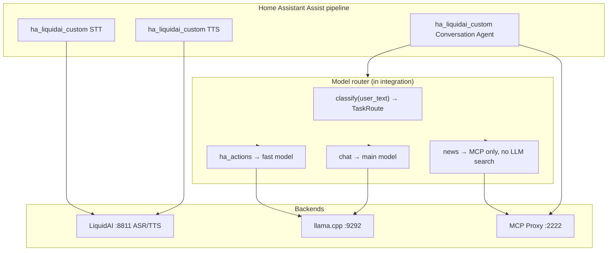
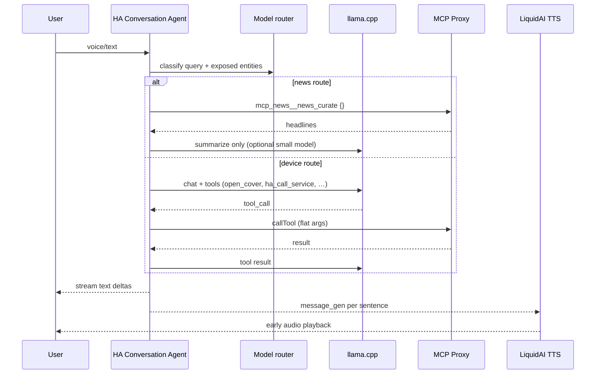

# LiquidAI Assist for Home Assistant — Implementation Plan

Project root: `~/Projects/ha_liquidai`  
Legacy stack: `~/Projects/ha_liquidai_n8n` (n8n + Webhook Conversation — to be retired)

## Goal

Replace the entire n8n + Webhook Conversation path with a **native Home Assistant custom integration** that:

1. Runs an **agentic tool loop** in Python (no LangChain, no webhook hop)
2. Calls **LiquidAI** directly for STT/TTS (`:8811`)
3. Calls **llama.cpp** (OpenAI-compatible) for LLM inference (`:9292`)
4. Calls **MCP Proxy** for mail, news, and extended tools (`:2222`)
5. Supports **multi-model routing** — different models/backends per task type
6. Streams conversation text and TTS audio natively through the Assist pipeline

## Why move off n8n

| Problem in n8n today | HA-native fix |
|----------------------|---------------|
| LangChain wraps MCP `callTool` badly (`value`, nested `toolName`) | Python loop with explicit JSON schema |
| Gemma picks SearXNG instead of `news_curate` | Route news → MCP-only path, no tool discovery |
| Webhook hop + NDJSON translation | Native `AbstractConversationAgent` |
| Parallel branch / execution-order bugs | Single asyncio agent loop |
| Prompt hacks in Code nodes (`tool_context`) | Structured context builder in Python |
| Batch TTS blocks playback | Streaming `async_stream_tts_audio()` (**done**) |

---

## Target architecture (final state)



**Agent loop (replaces n8n LangChain Agent):**



---

## Repository layout (expanded)

```
ha_liquidai/
├── README.md
├── PLAN.md
├── hacs.json
├── pyproject.toml
├── custom_components/
│   └── ha_liquidai_custom/
│       ├── __init__.py              # config entry, platform setup
│       ├── manifest.json
│       ├── const.py
│       ├── config_flow.py           # multi-step: LiquidAI, LLM, MCP, models
│       ├── liquidai_client.py       # ASR + TTS HTTP (rename from client.py)
│       ├── llm_client.py            # OpenAI-compatible chat + streaming
│       ├── mcp_client.py            # MCP Proxy JSON-RPC / callTool
│       ├── router.py                # TaskRoute + classify()
│       ├── agent.py                 # tool loop, memory, streaming
│       ├── context.py               # exposed entities, tool hints (port agent_input_code.js)
│       ├── tools.py                 # tool schemas + execute (MCP + hass.services)
│       ├── conversation.py          # AbstractConversationAgent
│       ├── stt.py                   # SpeechToTextEntity
│       ├── tts.py                   # TextToSpeechEntity (done)
│       ├── audio.py                   # TTS sanitize/split/trim (done)
│       ├── memory.py                # per-conversation_id history store
│       ├── strings.json
│       └── translations/en.json
├── tests/
│   ├── test_audio.py                # done
│   ├── test_router.py
│   ├── test_mcp_client.py
│   ├── test_context.py
│   └── test_agent_loop.py
├── scripts/
│   ├── deploy_to_ha.sh
│   ├── smoke_test_tts.py
│   └── smoke_test_mcp.py
└── docs/
    ├── assist-setup.md
    ├── migration-from-n8n.md        # full stack migration
    └── migration-from-n8n-tts.md
```

---

## Phases

### Phase 0 — Bootstrap ✅

- [x] Repo, manifest, `const.py`, deploy script
- [x] `custom_components/ha_liquidai_custom/` loads in HA

---

### Phase 1 — Config flow + 1-shot TTS ✅

- [x] Config flow (LiquidAI URL, system prompt, advanced timing)
- [x] `async_get_tts_audio()` with sentence chunking
- [x] Tests + ruff CI

---

### Phase 2 — Streaming TTS ✅

- [x] `async_stream_tts_audio()` + sentence buffer
- [x] Assist pipeline early playback (HA ≥ 2025.10)

---

### Phase 3 — LiquidAI STT (1 day) ✅

**Scope:** Replace n8n `/webhook/stt` with a native STT entity.

**Tasks**

1. **`stt.py`** — implement `SpeechToTextEntity`
   - Accept audio from pipeline
   - POST multipart to `{liquidai_url}/v1/asr`
   - Return transcript string

2. **`client.py`** — add `async def transcribe(audio_bytes, mime_type, …)`

3. **Config flow** — reuse LiquidAI base URL from existing entry (ASR prompt in prompt step)

4. **Assist wiring** — document STT entity in pipeline; remove Webhook Conversation STT sub-entry

**Exit criteria**

- [x] Voice command transcribed without n8n (deploy + pipeline switch required)
- [ ] Latency comparable to n8n HTTP Request path

---

### Phase 4 — Conversation agent + agentic loop (3–5 days)

**Scope:** Replace n8n `/webhook/agent` + Webhook Conversation with native conversation platform.

#### 4a. LLM client (`llm_client.py`)

```python
@dataclass
class LlmBackend:
    base_url: str          # http://192.168.10.31:9292/v1
    model: str             # unsloth/gemma-4-26B-A4B-it-GGUF:IQ4_XS
    api_key: str | None
    max_tokens: int = 4096
    temperature: float = 0.3
    timeout: float = 120.0

async def chat_completion(
    backend: LlmBackend,
    messages: list[dict],
    tools: list[dict] | None = None,
    stream: bool = False,
) -> ChatResult | AsyncIterator[ChatDelta]:
    ...
```

- OpenAI-compatible `/v1/chat/completions`
- Support `tools` / `tool_calls` (llama.cpp function calling)
- Optional: `chat_template_kwargs.enable_thinking: false` for voice latency
- Streaming deltas for Assist text streaming

#### 4b. Context builder (`context.py`)

Port logic from `ha_liquidai_n8n/scripts/agent_input_code.js`:

| Function | Purpose |
|----------|---------|
| `parse_exposed_entities()` | HA exposed entity list → prompt block |
| `is_affirmative()` / `is_news_query()` / `is_device_action()` | Inject tool hints |
| `entity_matches_query()` | Skip search when exposed entity fits |
| `build_system_message()` | Base prompt + tool_context + route-specific hints |

Hints to embed (learned from n8n production):

- **callTool shape:** top-level `toolName` + flat `arguments`; never `value`, never nested `toolName`
- **Cover/door:** `open_cover` / `close_cover`, not `open`
- **News:** `mcp_news__news_curate` only; never SearXNG / `searchToolsForDomain`
- **Email count:** `imap_mailbox_status {"mailbox":"INBOX"}`
- **Email dates:** `imap_search_messages` with flat fields + required `mailbox`

#### 4c. Tool execution (`tools.py`)

Two execution paths:

| Tool kind | Handler | Example |
|-----------|---------|---------|
| **Native HA** | `hass.services.async_call` | lights, covers, switches on exposed entities |
| **MCP Proxy** | `mcp_client.call_tool()` | news, mail, HA MCP search |

Expose to LLM as OpenAI function schemas (single meta-tool or per-tool — start with **one `mcp_call_tool` wrapper** matching n8n's working pattern):

```python
MCP_CALL_TOOL_SCHEMA = {
    "name": "mcp_call_tool",
    "parameters": {
        "type": "object",
        "properties": {
            "toolName": {"type": "string"},
            "arguments": {"type": "object"},
        },
        "required": ["toolName"],
    },
}
```

Alternatively map directly to `home_assistant__ha_call_service` for device actions (fewer hops, more reliable).

#### 4d. Agent loop (`agent.py`)

```python
async def run_agent(
    hass: HomeAssistant,
    user_input: ConversationInput,
    backend: LlmBackend,
    route: TaskRoute,
    max_iterations: int = 8,
) -> AsyncGenerator[str, None]:
    if route == TaskRoute.NEWS:
        brief = await mcp.call_tool("mcp_news__news_curate", {})
        messages = build_news_summarize_messages(user_input, brief)
        async for delta in llm.stream(messages, backend=route.summarize_backend):
            yield delta
        return

    messages = build_messages(user_input, route)
    tools = tools_for_route(route)

    for _ in range(max_iterations):
        result = await llm.chat(messages, tools=tools, backend=route.backend)
        if not result.tool_calls:
            async for delta in stream_or_yield(result.content):
                yield delta
            return
        for call in result.tool_calls:
            output = await execute_tool(hass, call)
            messages.append(tool_result_message(call, output))
```

#### 4e. Conversation platform (`conversation.py`)

- Subclass `AbstractConversationAgent` (or current HA conversation API for 2025.10+)
- Wire streaming response to Assist pipeline
- Pass `conversation_id` to `memory.py` for multi-turn (replaces n8n Memory node)
- Read exposed entities from `user_input.extra_system_prompt` / device context HA provides

#### 4f. Memory (`memory.py`)

- Store last N turns keyed by `conversation_id`
- Use `conversation.async_conversation_manager` storage or simple `hass.data` + JSON file
- Cap history length to fit model context

**Exit criteria**

- [ ] “Turn off dining room lights” with exposed entity — one tool call, ~7 s
- [ ] “Yes” after news offer — `news_curate`, no SearXNG error
- [ ] “Open Jonathans patio door” — search + `open_cover` when entity not exposed
- [ ] Multi-turn email follow-up works
- [ ] Text streaming visible in Assist
- [ ] Webhook Conversation + n8n agent webhook **not required**

---

### Phase 5 — Multi-model router + MCP client (2–3 days)

**Scope:** Route tasks to different LLM backends; robust MCP Proxy client.

#### 5a. Task routes (`router.py`)

```python
class TaskRoute(StrEnum):
    NEWS = "news"              # MCP news_curate → optional summarize LLM
    HA_ACTION = "ha_action"  # tool-focused, low temperature
    EMAIL = "email"            # structured MCP mail tools
    CHAT = "chat"              # general Q&A, main model

@dataclass
class RouteConfig:
    route: TaskRoute
    backend: LlmBackend | None   # None = MCP-only path
    max_iterations: int
    allow_mcp: bool
    allow_hass_native: bool
```

**Classifier (Phase 5a — heuristic first):**

```python
def classify(text: str, history: list, exposed: list) -> TaskRoute:
    if is_affirmative(text) and last_turn_offered_news(history):
        return TaskRoute.NEWS
    if is_news_query(text):
        return TaskRoute.NEWS
    if is_email_query(text):
        return TaskRoute.EMAIL
    if is_device_action(text):
        return TaskRoute.HA_ACTION
    return TaskRoute.CHAT
```

**Optional Phase 5b — classifier model:**

- Tiny model or 1-shot LLM call returning JSON `{"route":"ha_action"}`
- Configurable in config flow as “router model” separate from main model

#### 5b. Model router config (config flow / YAML)

| Setting | Default | Used for |
|---------|---------|----------|
| `llm_main_url` | `http://192.168.10.31:9292/v1` | Chat, complex replies |
| `llm_main_model` | `unsloth/gemma-4-26B-A4B-it-GGUF:IQ4_XS` | |
| `llm_action_url` | same as main (or separate) | HA device commands |
| `llm_action_model` | same or smaller Q4 model | Lower latency |
| `llm_action_temperature` | `0.1` | Reliable tool JSON |
| `llm_summarize_url` | same as main | Post-news_curate summary |
| `llm_summarize_model` | same or smaller | |
| `llm_max_tokens` | `4096` | |
| `enable_thinking` | `false` | Voice latency |
| `max_agent_iterations` | `8` | Per route override allowed |

Example per-route map in `const.py`:

```python
DEFAULT_ROUTE_BACKENDS = {
    TaskRoute.NEWS: RouteConfig(
        route=TaskRoute.NEWS,
        backend=None,  # MCP only, then summarize_backend
        max_iterations=2,
        allow_mcp=True,
        allow_hass_native=False,
    ),
    TaskRoute.HA_ACTION: RouteConfig(
        route=TaskRoute.HA_ACTION,
        backend=LlmBackendRef("action"),
        max_iterations=4,
        allow_mcp=True,
        allow_hass_native=True,
    ),
    ...
}
```

#### 5c. MCP client (`mcp_client.py`)

Direct HTTP client to existing proxy (same as llama UI / Cursor):

```python
class McpProxyClient:
    def __init__(self, base_url: str, bearer_token: str, session: aiohttp.ClientSession):
        ...

    async def initialize(self) -> None:
        # POST /mcp initialize + notifications/initialized
        # capture Mcp-Session-Id header

    async def call_tool(self, tool_name: str, arguments: dict | None = None) -> Any:
        # POST tools/call with name=callTool, arguments={toolName, arguments}
        # NEVER wrap args in "value"
        ...

    async def call_tool_direct(self, tool_name: str, arguments: dict | None = None) -> Any:
        # Optional: composite tools if proxy exposes them at top level
        ...
```

**Config:**

| Setting | Default |
|---------|---------|
| `mcp_url` | `http://192.168.10.31:2222/mcp` |
| `mcp_bearer_token` | from config flow (password field) |
| `mcp_timeout` | `120` s |

**Health check:** `GET http://192.168.10.31:2222/api/health` during config flow validation.

**Error handling:** Surface MCP errors as agent text (“I couldn't reach the mail server”) instead of raw JSON in Assist UI.

**Exit criteria**

- [ ] Router sends news queries to MCP-only path (no SearXNG)
- [ ] HA actions use action backend (configurable separate model)
- [ ] MCP client passes config flow validation with bearer token
- [ ] `scripts/smoke_test_mcp.py` calls `news_curate` and `ha_call_service` shape

---

### Phase 6 — Full migration + HACS polish (1–2 days)

**Tasks**

1. **Assist pipeline (single integration)**
   - STT → `ha_liquidai_custom` STT
   - Conversation → `ha_liquidai_custom` agent
   - TTS → `ha_liquidai_custom` TTS (already done)

2. **Remove from HA**
   - Webhook Conversation integration (or leave installed but unwired)
   - n8n webhook URLs from pipeline

3. **Retire n8n workflow** (`ha_liquidai_n8n`)
   - Archive workflow JSON
   - Update README: “legacy reference only”

4. **Docs**
   - `docs/migration-from-n8n.md` — step-by-step
   - Update `docs/assist-setup.md`

5. **HACS**
   - Rename display name to **LiquidAI Assist** (covers STT/TTS/Agent)
   - `hassfest` + ruff CI on full component
   - GitHub release tags

**Exit criteria**

- [ ] End-to-end voice: mic → STT → agent (tools) → streaming TTS → speaker
- [ ] No n8n container required for daily Assist use
- [ ] HACS install documented

---

## Code port map

### n8n TTS → Python (`audio.py`) ✅

| n8n | Python |
|-----|--------|
| `sanitizeForTts` | `sanitize_for_tts` |
| `splitForTts` | `split_for_tts` |
| `trimPcmSilence` | `trim_pcm_silence` |
| `concatWavBuffers` | `concat_wav_buffers` |

### n8n Agent input → Python (`context.py`)

| n8n (`agent_input_code.js`) | Python |
|-----------------------------|--------|
| `parseExposedEntities` | `parse_exposed_entities` |
| `formatExposedEntities` | `format_exposed_entities` |
| `isAffirmative` / `isNewsQuery` / `isDeviceActionQuery` | same |
| `entityMatchesQuery` | `entity_matches_query` |
| `tool_context` injection | `build_tool_context()` |

### n8n MCP hints → Python (`const.py` + `context.py`)

Port `mcpAgentHint` from `simple_n8n_workflow_hybrid.sdk.js` as `DEFAULT_TOOL_INSTRUCTIONS` — keep in sync when tuning production prompts.

### n8n LangChain Agent → Python (`agent.py`)

| n8n | Python |
|-----|--------|
| LangChain Agent node | `run_agent()` while-loop |
| MCP Client Tool sub-node | `McpProxyClient.call_tool()` |
| Memory Buffer Window | `memory.py` keyed by `conversation_id` |
| LLM Chat OpenAI sub-node | `llm_client.chat_completion()` |
| Agent input Code node | `context.build_system_message()` |
| Streaming webhook | `conversation.py` native streaming |

---

## Config reference (full integration)

| Setting | Default | Phase |
|---------|---------|-------|
| LiquidAI URL | `http://192.168.10.31:8811` | 1 ✅ |
| TTS system prompt | `Perform TTS. Use the US female voice.` | 1 ✅ |
| TTS keep edge / gap ms | 100 / 5 | 1 ✅ |
| LLM main URL / model | `:9292/v1`, Gemma | 4 |
| LLM action URL / model | same or separate | 5 |
| LLM temperature (action / chat) | 0.1 / 0.3 | 5 |
| MCP URL / bearer token | `:2222/mcp` | 5 |
| Max agent iterations | 8 | 4 |
| Enable thinking | false | 5 |
| Conversation history turns | 10 | 4 |

---

## Testing checklist

### Phase 3 (STT)

- [ ] Short voice utterance transcribed correctly
- [ ] Silent clip returns empty string without crash

### Phase 4 (Agent)

- [ ] Light on/off with exposed entity — 1 MCP or native call
- [ ] Cover open without exposed entity — search + open_cover
- [ ] News / “Yes” after offer — news_curate, no SearXNG
- [ ] Email unread count
- [ ] Email “from when” follow-up
- [ ] Streaming text in Assist debug
- [ ] Conversation memory across turns (same `conversation_id`)

### Phase 5 (Router + MCP)

- [ ] News route skips tool discovery
- [ ] Action route uses action model when configured separately
- [ ] MCP bearer auth failure shows friendly error
- [ ] Malformed tool args caught before MCP call (validation layer)

### End-to-end (Phase 6)

- [ ] Full voice pipeline without n8n
- [ ] Time to first TTS audio on long reply < 4 s after first sentence

---

## Risks and mitigations

| Risk | Mitigation |
|------|------------|
| llama.cpp tool calling inconsistent | Strict schemas; native `hass.services` for simple devices; low temperature on action route |
| Context window exceeded (many exposed entities) | Cap exposed entities in docs; compress history in memory.py |
| MCP proxy down | Config flow health check; graceful degradation message |
| HA conversation API changes | Pin minimum HA version; follow `AbstractConversationAgent` docs |
| Multi-model config complexity | Sensible defaults (single backend); advanced section in config flow |

---

## Suggested timeline (after TTS ✅)

```
Week 1
  Day 1       Phase 3 — STT entity
  Day 2–4     Phase 4a–c — llm_client, context, tools, agent loop
  Day 5       Phase 4d–f — conversation platform + memory

Week 2
  Day 1–2     Phase 5 — router + mcp_client
  Day 3       Phase 6 — migration docs, retire n8n wiring
  Day 4       HACS polish + end-to-end testing
```

---

## Success metrics

| Metric | Today (n8n) | Target (HA-native) |
|--------|-------------|---------------------|
| Agent latency (simple HA cmd) | ~7–15 s | < 5 s |
| MCP tool arg errors | Frequent | Rare (validated in Python) |
| Time to first TTS audio | ~15–20 s | < 4 s after first sentence ✅ (TTS done) |
| Moving parts for Assist | HA + Webhook Conv + n8n + 3 services | HA + 3 services |
| Multi-model | Single Gemma | Per-route backends |

---

## Next action

**Phase 4:** Add `conversation.py`, `agent.py`, `llm_client.py`, and the native tool loop to replace n8n `/webhook/agent`.
