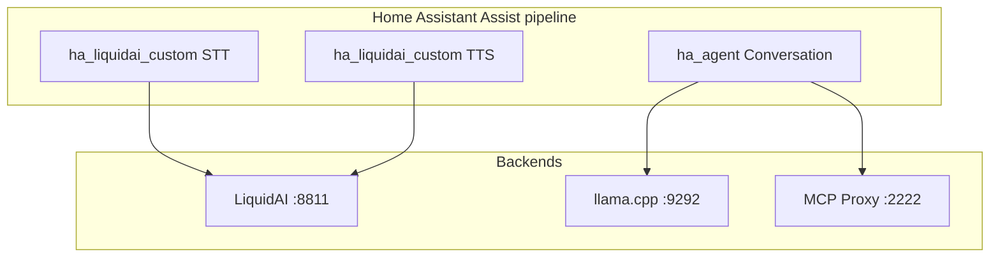

# LiquidAI for Home Assistant — STT & TTS

Project root: `~/Projects/ha_liquidai`  
Agent / conversation: [`~/Projects/ha_agent`](../ha_agent)  
Legacy stack: `~/Projects/ha_liquidai_n8n` (n8n + Webhook Conversation — to be retired)

## Goal

Native Home Assistant integration for **LiquidAI speech only**:

1. **STT** — Assist pipeline → LiquidAI `/v1/asr` (`:8811`)
2. **TTS** — Assist pipeline → LiquidAI `/v1/tts` with streaming sentence chunks

Conversation, LLM, and MCP tooling live in the separate **[ha_agent](https://github.com/holger81/ha_agent)** integration.

## Target architecture



## Repository layout

```
ha_liquidai/
├── custom_components/ha_liquidai_custom/
│   ├── client.py          # LiquidAI ASR/TTS HTTP
│   ├── stt.py             # SpeechToTextEntity
│   ├── tts.py             # TextToSpeechEntity (streaming)
│   ├── audio.py           # TTS sanitize/split/trim
│   ├── config_flow.py     # LiquidAI URL + prompts + audio tuning
│   └── ...
├── tests/
├── scripts/
└── docs/
```

## Phases

### Phase 0 — Bootstrap ✅

- [x] Repo, manifest, deploy script

### Phase 1 — Config flow + TTS ✅

- [x] Config flow, 1-shot TTS, tests + ruff CI

### Phase 2 — Streaming TTS ✅

- [x] `async_stream_tts_audio()` + Assist early playback (HA ≥ 2025.10)

### Phase 3 — LiquidAI STT ✅

- [x] `SpeechToTextEntity`, PCM→WAV wrap for Assist pipeline
- [x] Document pipeline wiring with [ha_agent](../ha_agent)

## Assist pipeline wiring

| Stage | Integration |
|-------|-------------|
| Speech-to-text | **LiquidAI** (`stt.ha_liquidai_custom`) |
| Conversation | **[HA Agent](https://github.com/holger81/ha_agent)** (`conversation.ha_agent`) |
| Text-to-speech | **LiquidAI** (`tts.ha_liquidai_custom`) |

See [docs/assist-setup.md](docs/assist-setup.md).

## Next action

Keep LiquidAI STT/TTS stable; track agent work in **ha_agent** PLAN.md.
