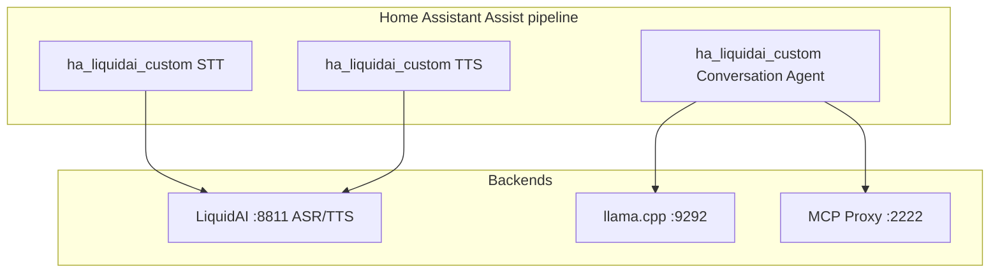
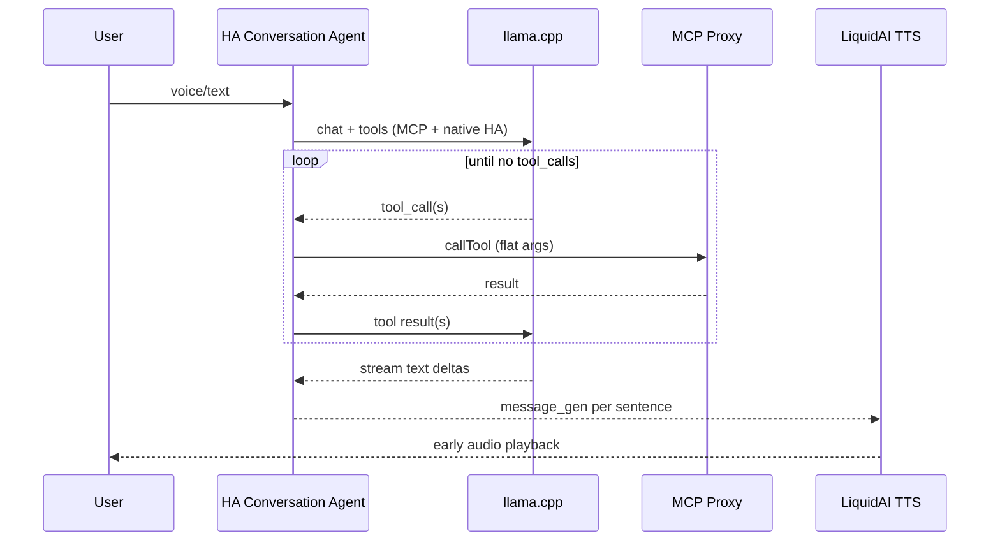

# LiquidAI Assist for Home Assistant — Implementation Plan

Project root: `~/Projects/ha_liquidai`  
Legacy stack: `~/Projects/ha_liquidai_n8n` (n8n + Webhook Conversation — to be retired)

## Goal

Replace the entire n8n + Webhook Conversation path with a **native Home Assistant custom integration** that:

1. Runs an **agentic tool loop** in Python (no LangChain, no webhook hop)
2. Calls **LiquidAI** directly for STT/TTS (`:8811`)
3. Calls **llama.cpp** (OpenAI-compatible) for LLM inference (`:9292`)
4. Calls **MCP Proxy** for mail, news, and extended tools (`:2222`)
5. Supports **multi-model routing** — optional different LLM backends per task *style* (e.g. actions vs chat), not topic bypasses
6. Streams conversation text and TTS audio natively through the Assist pipeline

## Why move off n8n

| Problem in n8n today | HA-native fix |
|----------------------|---------------|
| LangChain wraps MCP `callTool` badly (`value`, nested `toolName`) | Python loop with explicit JSON schema |
| Gemma picks SearXNG instead of `news_curate` | Clear MCP tool instructions + native tool loop (model chooses tools) |
| Webhook hop + NDJSON translation | Native `AbstractConversationAgent` |
| Parallel branch / execution-order bugs | Single asyncio agent loop |
| Prompt hacks in Code nodes (`tool_context`) | Structured context builder in Python |
| Batch TTS blocks playback | Streaming `async_stream_tts_audio()` (**done**) |

---

## Target architecture (final state)



**Agent loop (replaces n8n LangChain Agent):** one LLM + tool loop; the model selects MCP and HA tools. No hard-coded news (or other topic) bypass paths.



---

## Repository layout (expanded)

```
ha_liquidai/
├── README.md
├── PLAN.md
├── hacs.json
├── pyproject.toml
├── custom_components/
│   └── ha_liquidai_custom/
│       ├── __init__.py              # config entry, platform setup
│       ├── manifest.json
│       ├── const.py
│       ├── config_flow.py           # multi-step: LiquidAI, LLM, MCP, models
│       ├── liquidai_client.py       # ASR + TTS HTTP (rename from client.py)
│       ├── llm_client.py            # OpenAI-compatible chat + streaming
│       ├── mcp_client.py            # MCP Proxy JSON-RPC / callTool
│       ├── router.py                # optional TaskRoute + classify() (Phase 5)
│       ├── agent.py                 # tool loop, memory, streaming
│       ├── context.py               # exposed entities, tool hints (port agent_input_code.js)
│       ├── tools.py                 # tool schemas + execute (MCP + hass.services)
│       ├── conversation.py          # AbstractConversationAgent
│       ├── stt.py                   # SpeechToTextEntity
│       ├── tts.py                   # TextToSpeechEntity (done)
│       ├── audio.py                   # TTS sanitize/split/trim (done)
│       ├── memory.py                # per-conversation_id history store
│       ├── strings.json
│       └── translations/en.json
├── tests/
│   ├── test_audio.py                # done
│   ├── test_router.py
│   ├── test_mcp_client.py
│   ├── test_context.py
│   └── test_agent_loop.py
├── scripts/
│   ├── deploy_to_ha.sh
│   ├── smoke_test_tts.py
│   └── smoke_test_mcp.py
└── docs/
    ├── assist-setup.md
    ├── migration-from-n8n.md        # full stack migration
    └── migration-from-n8n-tts.md
```

---

## UI configuration (config flow)

**Requirement:** Every backend URL, model ID, credential, timeout, and agent path must be editable in Home Assistant — no hardcoded hosts or models in runtime code. `const.py` supplies **defaults for form fields only**; clients read `config_entry.data` and `config_entry.options`.

### Principles

| Rule | Detail |
|------|--------|
| No silent hardcoding | Do not embed `:8811`, `:9292`, `:2222`, model slugs, or paths in `agent.py` / clients |
| Reconfigure | URLs and secrets changeable via **Configure → Reconfigure** without removing the integration |
| Options flow | Tuning knobs (temperature, iterations, audio) editable under **Configure → Options** |
| Validate on save | Each connection step probes its endpoint before the entry is saved |
| Sensible defaults | Pre-fill forms from `const.py` so a local stack works out of the box |

### Config flow steps (target)

| Step | Fields | Validates |
|------|--------|-----------|
| **1. LiquidAI** ✅ | Base URL, request timeout | Reachability of LiquidAI |
| **2. Prompts** ✅ (extend) | TTS prompt, ASR prompt, **agent system prompt**, **tool instructions** (multiline) | — |
| **3. LLM** | Base URL, model ID, API key (optional), max tokens, temperature, timeout, **enable thinking** (bool) | `GET /v1/models` or minimal chat probe |
| **4. MCP** | Proxy URL, bearer token, timeout, **health URL** (optional; default `{host}/api/health`) | Health GET + MCP initialize |
| **5. Agent** | Max iterations, history turns, **enable conversation streaming** (bool) | — |
| **6. Advanced audio** ✅ | Chunk length, speech speed, stream-first-chunk, silence trim | — |

Phase 5 adds **router options** (still UI-only, no YAML):

| Options (Phase 5) | Fields |
|-------------------|--------|
| Action backend | **Use separate action model** (bool); if true: action URL, action model ID, action temperature (defaults copy from main, all overridable) |

### Full settings map (UI ↔ storage)

| UI label | Config key | Default | Phase |
|----------|------------|---------|-------|
| LiquidAI URL | `base_url` | `http://192.168.10.31:8811` | 1 ✅ |
| Request timeout | `timeout` | `120` | 1 ✅ |
| TTS system prompt | `system_prompt` | US female voice | 1 ✅ |
| ASR system prompt | `asr_system_prompt` | `Perform ASR.` | 3 ✅ |
| Agent system prompt | `agent_system_prompt` | (port from n8n) | 4 |
| Tool instructions | `tool_instructions` | (port `mcpAgentHint`) | 4 |
| LLM base URL | `llm_base_url` | `http://192.168.10.31:9292/v1` | 4 |
| LLM model | `llm_model` | Gemma slug | 4 |
| LLM API key | `llm_api_key` | empty | 4 |
| LLM max tokens | `llm_max_tokens` | `4096` | 4 |
| LLM temperature | `llm_temperature` | `0.3` | 4 |
| LLM timeout | `llm_timeout` | `120` | 4 |
| Enable thinking | `llm_enable_thinking` | `false` | 4 |
| MCP URL | `mcp_url` | `http://192.168.10.31:2222/mcp` | 4 |
| MCP bearer token | `mcp_bearer_token` | (required) | 4 |
| MCP timeout | `mcp_timeout` | `120` | 4 |
| MCP health URL | `mcp_health_url` | derived from MCP host | 4 |
| Max agent iterations | `max_agent_iterations` | `8` | 4 |
| Conversation history turns | `conversation_history_turns` | `10` | 4 |
| Enable response streaming | `conversation_enable_streaming` | `true` | 4 |
| Use separate action model | `use_action_backend` | `false` | 5 |
| Action LLM URL | `action_llm_base_url` | same as main | 5 |
| Action LLM model | `action_llm_model` | same as main | 5 |
| Action temperature | `action_llm_temperature` | `0.1` | 5 |
| Speech speed, chunk tuning | options ✅ | see Phase 1–3 | ✅ |

Runtime code loads backends via helpers, e.g. `get_llm_backend(entry, style="chat"|"action")` — never inline URLs.

### Exit criteria (UI)

- [ ] Changing LiquidAI / LLM / MCP URLs in UI takes effect after reload (no code edit)
- [ ] Changing model IDs in UI switches the model without redeploy
- [ ] MCP token and LLM API key stored as config secrets (password fields)
- [ ] Reconfigure flow updates connections; Options flow updates tuning
- [ ] `hassfest` config flow schema matches `strings.json` / `translations/en.json`

---

## Phases

### Phase 0 — Bootstrap ✅

- [x] Repo, manifest, `const.py`, deploy script
- [x] `custom_components/ha_liquidai_custom/` loads in HA

---

### Phase 1 — Config flow + 1-shot TTS ✅

- [x] Config flow (LiquidAI URL, system prompt, advanced timing)
- [x] `async_get_tts_audio()` with sentence chunking
- [x] Tests + ruff CI

---

### Phase 2 — Streaming TTS ✅

- [x] `async_stream_tts_audio()` + sentence buffer
- [x] Assist pipeline early playback (HA ≥ 2025.10)

---

### Phase 3 — LiquidAI STT (1 day) ✅

**Scope:** Replace n8n `/webhook/stt` with a native STT entity.

**Tasks**

1. **`stt.py`** — implement `SpeechToTextEntity`
   - Accept audio from pipeline
   - POST multipart to `{liquidai_url}/v1/asr`
   - Return transcript string

2. **`client.py`** — add `async def transcribe(audio_bytes, mime_type, …)`

3. **Config flow** — reuse LiquidAI base URL from existing entry (ASR prompt in prompt step)

4. **Assist wiring** — document STT entity in pipeline; remove Webhook Conversation STT sub-entry

**Exit criteria**

- [x] Voice command transcribed without n8n (deploy + pipeline switch required)
- [ ] Latency comparable to n8n HTTP Request path

---

### Phase 4 — Conversation agent + agentic loop (3–5 days)

**Scope:** Replace n8n `/webhook/agent` + Webhook Conversation with native conversation platform.

#### 4a. LLM client (`llm_client.py`)

```python
@dataclass
class LlmBackend:
    base_url: str          # from config_entry: llm_base_url / action_llm_base_url
    model: str             # from config_entry: llm_model / action_llm_model
    api_key: str | None    # from config_entry: llm_api_key
    max_tokens: int        # from config_entry: llm_max_tokens
    temperature: float     # from config_entry: llm_temperature / action_llm_temperature
    timeout: float         # from config_entry: llm_timeout
    enable_thinking: bool  # from config_entry: llm_enable_thinking

async def chat_completion(
    backend: LlmBackend,
    messages: list[dict],
    tools: list[dict] | None = None,
    stream: bool = False,
) -> ChatResult | AsyncIterator[ChatDelta]:
    ...
```

- OpenAI-compatible `/v1/chat/completions`
- Support `tools` / `tool_calls` (llama.cpp function calling)
- Optional: `chat_template_kwargs.enable_thinking: false` for voice latency
- Streaming deltas for Assist text streaming

#### 4b. Context builder (`context.py`)

Port logic from `ha_liquidai_n8n/scripts/agent_input_code.js` where it helps the **model** choose tools (not to bypass the LLM):

| Function | Purpose |
|----------|---------|
| `parse_exposed_entities()` | HA exposed entity list → prompt block |
| `entity_matches_query()` | Optional hint when exposed entity fits query |
| `build_system_message()` | Base prompt + MCP/HA tool instructions |

Tool instructions live in the system prompt and MCP integration layer — the LLM decides when to call `news_curate`, mail tools, HA services, etc. **No special news route or MCP-only bypass in Phase 4.**

Hints to embed (learned from n8n production):

- **callTool shape:** top-level `toolName` + flat `arguments`; never `value`, never nested `toolName`
- **Cover/door:** `open_cover` / `close_cover`, not `open`
- **News:** prefer `mcp_news__news_curate` via MCP; document in system prompt — routing is the model’s job, not a hard-coded branch
- **Email count:** `imap_mailbox_status {"mailbox":"INBOX"}`
- **Email dates:** `imap_search_messages` with flat fields + required `mailbox`

#### 4c. Tool execution (`tools.py`)

Two execution paths:

| Tool kind | Handler | Example |
|-----------|---------|---------|
| **Native HA** | `hass.services.async_call` | lights, covers, switches on exposed entities |
| **MCP Proxy** | `mcp_client.call_tool()` | news, mail, HA MCP search |

Expose to LLM as OpenAI function schemas (single meta-tool or per-tool — start with **one `mcp_call_tool` wrapper** matching n8n's working pattern):

```python
MCP_CALL_TOOL_SCHEMA = {
    "name": "mcp_call_tool",
    "parameters": {
        "type": "object",
        "properties": {
            "toolName": {"type": "string"},
            "arguments": {"type": "object"},
        },
        "required": ["toolName"],
    },
}
```

Alternatively map directly to `home_assistant__ha_call_service` for device actions (fewer hops, more reliable).

#### 4d. Agent loop (`agent.py`)

```python
async def run_agent(
    hass: HomeAssistant,
    user_input: ConversationInput,
    backend: LlmBackend,
    max_iterations: int = 8,
) -> AsyncGenerator[str, None]:
    messages = build_messages(user_input)
    tools = all_tools()  # MCP meta-tool(s) + optional native HA tools

    for _ in range(max_iterations):
        result = await llm.chat(messages, tools=tools, backend=backend)
        if not result.tool_calls:
            async for delta in stream_or_yield(result.content):
                yield delta
            return
        for call in result.tool_calls:
            output = await execute_tool(hass, call)
            messages.append(tool_result_message(call, output))
```

News, email, device control, and general chat all use this same loop. Correct tool choice (e.g. `mcp_news__news_curate` vs search) is enforced via **system prompt + MCP tool descriptions**, not integration-side topic routing.

#### 4e. Conversation platform (`conversation.py`)

- Subclass `AbstractConversationAgent` (or current HA conversation API for 2025.10+)
- Wire streaming response to Assist pipeline
- Pass `conversation_id` to `memory.py` for multi-turn (replaces n8n Memory node)
- Read exposed entities from `user_input.extra_system_prompt` / device context HA provides

#### 4f. Memory (`memory.py`)

- Store last N turns keyed by `conversation_id`
- Use `conversation.async_conversation_manager` storage or simple `hass.data` + JSON file
- Cap history length to fit model context

**Exit criteria**

- [ ] “Turn off dining room lights” with exposed entity — one tool call, ~7 s
- [ ] “What’s the news?” — model calls `news_curate` (or other MCP news tools) via normal tool loop
- [ ] “Yes” after assistant offered news — model follows up with appropriate MCP tool call
- [ ] “Open Jonathans patio door” — search + `open_cover` when entity not exposed
- [ ] Multi-turn email follow-up works
- [ ] Text streaming visible in Assist
- [ ] Webhook Conversation + n8n agent webhook **not required**
- [ ] All LLM/MCP/agent settings read from config entry (no hardcoded model URLs in runtime modules)

#### 4g. Config flow extensions (`config_flow.py`)

Extend the existing multi-step flow per **UI configuration** above:

1. **Step 3 — LLM:** URL, model, API key, max tokens, temperature, timeout, enable thinking; validate with `/v1/models` or test completion
2. **Step 4 — MCP:** URL, bearer token, timeout, optional health URL; validate health + initialize
3. **Step 2 — Prompts:** add `agent_system_prompt`, `tool_instructions`
4. **Step 5 — Agent:** max iterations, history turns, enable streaming
5. **`async_step_reconfigure`:** LiquidAI URL, LLM URL, MCP URL, tokens (migration without YAML)
6. **Options flow:** audio tuning ✅; Phase 5 adds action-backend toggles

**Exit criteria (config flow)**

- [ ] New install completes all steps from UI only
- [ ] Changing LLM model or MCP URL in UI takes effect after reload
- [ ] Existing STT/TTS entry can be reconfigured to add agent settings

---

### Phase 5 — Multi-model router + MCP client (2–3 days)

**Scope:** Optional routing to different LLM backends for latency/reliability; robust MCP Proxy client. **Not** topic-specific bypasses (news, email, etc.) — those stay in the model + MCP tool surface from Phase 4.

#### 5a. Task routes (`router.py`) — optional, Phase 5+

Use routing only for **backend selection** (e.g. lower temperature / smaller model for device commands), not to skip the LLM for specific intents.

```python
class TaskRoute(StrEnum):
    HA_ACTION = "ha_action"  # tool-focused, low temperature
    CHAT = "chat"            # general Q&A, main model

@dataclass
class RouteConfig:
    route: TaskRoute
    backend: LlmBackend
    max_iterations: int
    allow_mcp: bool
    allow_hass_native: bool
```

**Classifier (Phase 5 — heuristic first, optional):**

```python
def classify(text: str, history: list, exposed: list) -> TaskRoute:
    if is_device_action(text):
        return TaskRoute.HA_ACTION
    return TaskRoute.CHAT
```

Do **not** add `TaskRoute.NEWS`, `TaskRoute.EMAIL`, or other topic routes that call MCP before/alongside the LLM. News and mail are ordinary tool calls the model makes inside `run_agent()`.

**Optional Phase 5b — classifier model:**

- Tiny model or 1-shot LLM call returning JSON `{"route":"ha_action"}`
- Configurable in config flow as “router model” separate from main model

#### 5b. Model router config (config flow options only)

All router settings are **options-flow** fields (see UI configuration table). No `configuration.yaml`, no hardcoded backend map in `router.py`.

| Setting | Default | UI location |
|---------|---------|-------------|
| `use_action_backend` | `false` | Options → Router |
| `action_llm_base_url` | copy of `llm_base_url` | Options (shown when separate action model enabled) |
| `action_llm_model` | copy of `llm_model` | Options |
| `action_llm_temperature` | `0.1` | Options |

Example per-route map in `const.py`:

```python
DEFAULT_ROUTE_BACKENDS = {
    # Loaded at runtime from config_entry.options — not fixed host/model strings
    TaskRoute.HA_ACTION: RouteConfig(...),
    TaskRoute.CHAT: RouteConfig(...),
}
```

#### 5c. MCP client (`mcp_client.py`)

Direct HTTP client to existing proxy (same as llama UI / Cursor):

```python
class McpProxyClient:
    def __init__(self, base_url: str, bearer_token: str, session: aiohttp.ClientSession):
        ...

    async def initialize(self) -> None:
        # POST /mcp initialize + notifications/initialized
        # capture Mcp-Session-Id header

    async def call_tool(self, tool_name: str, arguments: dict | None = None) -> Any:
        # POST tools/call with name=callTool, arguments={toolName, arguments}
        # NEVER wrap args in "value"
        ...

    async def call_tool_direct(self, tool_name: str, arguments: dict | None = None) -> Any:
        # Optional: composite tools if proxy exposes them at top level
        ...
```

**Config:** all values from config entry (see UI configuration table).

| Setting | Config key | Default |
|---------|------------|---------|
| MCP URL | `mcp_url` | `http://192.168.10.31:2222/mcp` |
| MCP bearer token | `mcp_bearer_token` | (user-provided) |
| MCP timeout | `mcp_timeout` | `120` s |
| MCP health URL | `mcp_health_url` | derived from MCP URL host |

**Health check:** `GET http://192.168.10.31:2222/api/health` during config flow validation.

**Error handling:** Surface MCP errors as agent text (“I couldn't reach the mail server”) instead of raw JSON in Assist UI.

**Exit criteria**

- [ ] Optional action route uses action backend when configured (device commands only)
- [ ] MCP client passes config flow validation with bearer token
- [ ] `scripts/smoke_test_mcp.py` calls `news_curate` and `ha_call_service` shape via direct MCP (smoke test), not via a news bypass in the agent

---

### Phase 6 — Full migration + HACS polish (1–2 days)

**Tasks**

1. **Assist pipeline (single integration)**
   - STT → `ha_liquidai_custom` STT
   - Conversation → `ha_liquidai_custom` agent
   - TTS → `ha_liquidai_custom` TTS (already done)

2. **Remove from HA**
   - Webhook Conversation integration (or leave installed but unwired)
   - n8n webhook URLs from pipeline

3. **Retire n8n workflow** (`ha_liquidai_n8n`)
   - Archive workflow JSON
   - Update README: “legacy reference only”

4. **Docs**
   - `docs/migration-from-n8n.md` — step-by-step
   - Update `docs/assist-setup.md`

5. **HACS**
   - Rename display name to **LiquidAI Assist** (covers STT/TTS/Agent)
   - `hassfest` + ruff CI on full component
   - GitHub release tags

**Exit criteria**

- [ ] End-to-end voice: mic → STT → agent (tools) → streaming TTS → speaker
- [ ] No n8n container required for daily Assist use
- [ ] HACS install documented

---

## Code port map

### n8n TTS → Python (`audio.py`) ✅

| n8n | Python |
|-----|--------|
| `sanitizeForTts` | `sanitize_for_tts` |
| `splitForTts` | `split_for_tts` |
| `trimPcmSilence` | `trim_pcm_silence` |
| `concatWavBuffers` | `concat_wav_buffers` |

### n8n Agent input → Python (`context.py`)

| n8n (`agent_input_code.js`) | Python |
|-----------------------------|--------|
| `parseExposedEntities` | `parse_exposed_entities` |
| `formatExposedEntities` | `format_exposed_entities` |
| `is_affirmative` / `is_news_query` / `is_device_action` | optional hints in `build_system_message()` only — not route classifiers |
| `entityMatchesQuery` | `entity_matches_query` |
| `tool_context` injection | `build_tool_context()` |

### n8n MCP hints → Python (`const.py` + `context.py`)

Port `mcpAgentHint` from `simple_n8n_workflow_hybrid.sdk.js` as `DEFAULT_TOOL_INSTRUCTIONS` — keep in sync when tuning production prompts.

### n8n LangChain Agent → Python (`agent.py`)

| n8n | Python |
|-----|--------|
| LangChain Agent node | `run_agent()` while-loop |
| MCP Client Tool sub-node | `McpProxyClient.call_tool()` |
| Memory Buffer Window | `memory.py` keyed by `conversation_id` |
| LLM Chat OpenAI sub-node | `llm_client.chat_completion()` |
| Agent input Code node | `context.build_system_message()` |
| Streaming webhook | `conversation.py` native streaming |

---

## Config reference (full integration)

See **UI configuration** for the authoritative field list. Summary:

| Area | Configurable in UI | Phase |
|------|-------------------|-------|
| LiquidAI URL, TTS/ASR prompts, audio tuning | ✅ Setup + Options | 1–3 ✅ |
| LLM URL, model, key, tokens, temperature, thinking | Setup + Reconfigure | 4 |
| MCP URL, token, health URL, timeout | Setup + Reconfigure | 4 |
| Agent prompt, tool instructions, iterations, history, streaming | Setup + Options | 4 |
| Optional action model (URL, model, temperature) | Options | 5 |

**Not allowed:** `configuration.yaml` keys, environment variables, or Python constants used as runtime endpoints (defaults for forms only).

---

## Testing checklist

### Phase 3 (STT)

- [ ] Short voice utterance transcribed correctly
- [ ] Silent clip returns empty string without crash

### Phase 4 (Agent)

- [ ] Light on/off with exposed entity — 1 MCP or native call
- [ ] Cover open without exposed entity — search + open_cover
- [ ] “What’s the news?” / “Yes” after news offer — model selects MCP news tools in agent loop
- [ ] Email unread count
- [ ] Email “from when” follow-up
- [ ] Streaming text in Assist debug
- [ ] Conversation memory across turns (same `conversation_id`)

### Phase 5 (Router + MCP)

- [ ] Action route (if enabled) uses action model for device commands only
- [ ] MCP bearer auth failure shows friendly error
- [ ] Malformed tool args caught before MCP call (validation layer)

### End-to-end (Phase 6)

- [ ] Full voice pipeline without n8n
- [ ] Time to first TTS audio on long reply < 4 s after first sentence
- [ ] Pointing all three backends at alternate hosts/models via UI only (no code change)

---

## Risks and mitigations

| Risk | Mitigation |
|------|------------|
| llama.cpp tool calling inconsistent | Strict schemas; native `hass.services` for simple devices; low temperature on action route |
| Context window exceeded (many exposed entities) | Cap exposed entities in docs; compress history in memory.py |
| MCP proxy down | Config flow health check; graceful degradation message |
| HA conversation API changes | Pin minimum HA version; follow `AbstractConversationAgent` docs |
| Multi-model config complexity | All backends in config flow with defaults; optional action model behind one toggle |
| Hardcoded endpoints slip in during Phase 4 | Code review + lint/grep CI check for `:8811`, `:9292`, `:2222` in non-const modules |

---

## Suggested timeline (after TTS ✅)

```
Week 1
  Day 1       Phase 3 — STT entity
  Day 2–4     Phase 4a–c — llm_client, context, tools, agent loop
  Day 5       Phase 4d–f — conversation platform + memory

Week 2
  Day 1–2     Phase 5 — router + mcp_client
  Day 3       Phase 6 — migration docs, retire n8n wiring
  Day 4       HACS polish + end-to-end testing
```

---

## Success metrics

| Metric | Today (n8n) | Target (HA-native) |
|--------|-------------|---------------------|
| Agent latency (simple HA cmd) | ~7–15 s | < 5 s |
| MCP tool arg errors | Frequent | Rare (validated in Python) |
| Time to first TTS audio | ~15–20 s | < 4 s after first sentence ✅ (TTS done) |
| Moving parts for Assist | HA + Webhook Conv + n8n + 3 services | HA + 3 services |
| Multi-model | Single Gemma | Optional per-style backends (action vs chat); tools unified |

---

## Next action

**Phase 4:** Add `conversation.py`, `agent.py`, `llm_client.py`, config flow steps for LLM/MCP/agent, and the native tool loop to replace n8n `/webhook/agent`. All models and paths must come from the UI config map above.
