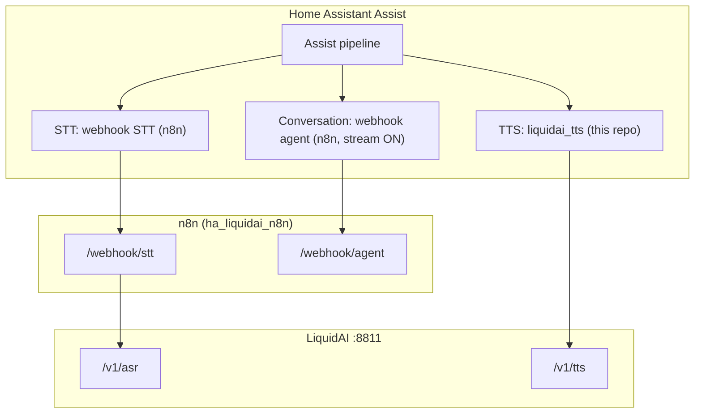
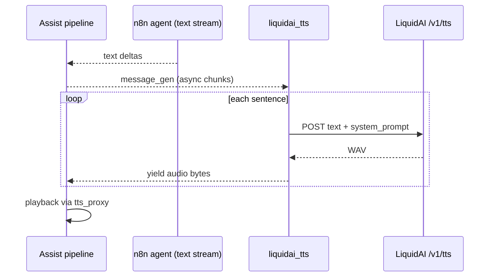

# LiquidAI TTS for Home Assistant — Implementation Plan

Project root: `~/Projects/ha_liquidai`  
Related stack: `~/Projects/ha_liquidai_n8n` (n8n webhooks for agent/STT; TTS moves here)

## Goal

Replace the n8n `/webhook/tts` batch path with a **native Home Assistant custom integration** that:

1. Calls LiquidAI directly at `http://192.168.10.31:8811/v1/tts`
2. Implements **`async_stream_tts_audio()`** so Assist can start playback before the full agent reply is ready
3. Keeps **`async_get_tts_audio()`** for automations and non-streaming `tts.speak`
4. Reuses proven text/audio logic from `ha_liquidai_n8n` (sanitize, sentence split, PCM trim, gap)

## Why a new repo

| Concern | Decision |
|---------|----------|
| No existing HACS LiquidAI TTS | Build custom component |
| Webhook Conversation TTS is one-shot HTTP | Cannot stream without HA-side entity |
| LiquidAI API is form POST `/v1/tts`, not OpenAI `/v1/audio/speech` | Dedicated client, not `openai_tts` |
| n8n adds latency and blocks until merge completes | Direct HA → LiquidAI for TTS only |

Agent + STT stay in n8n; only **TTS moves to HA**.

---

## Target architecture



**Streaming path (Assist with long replies):**



---

## Repository layout

```
ha_liquidai/
├── README.md
├── PLAN.md                          # this file
├── hacs.json                        # Phase 4 — HACS metadata
├── custom_components/
│   └── liquidai_tts/
│       ├── __init__.py              # config entry setup
│       ├── manifest.json
│       ├── const.py                 # defaults, domain
│       ├── config_flow.py           # UI: URL, prompt, timing
│       ├── client.py                # aiohttp → /v1/tts
│       ├── audio.py                 # sanitize, split, trim, gap (port from n8n)
│       ├── tts.py                   # TextToSpeechEntity
│       ├── strings.json             # config flow strings
│       └── translations/
│           └── en.json
├── scripts/
│   ├── deploy_to_ha.sh              # rsync/scp to HA config/custom_components
│   └── smoke_test_tts.py            # optional: hit /v1/tts without HA
└── docs/
    ├── assist-setup.md              # pipeline wiring
    └── migration-from-n8n-tts.md
```

---

## Phases

### Phase 0 — Bootstrap (½ day)

**Deliverables**

- [ ] Init git repo in `~/Projects/ha_liquidai`
- [ ] Add `manifest.json` skeleton (`domain: liquidai_tts`, version `0.1.0`)
- [ ] Document env defaults in `const.py`:
  - `DEFAULT_URL = "http://192.168.10.31:8811"`
  - `DEFAULT_SYSTEM_PROMPT = "Perform TTS. Use the US female voice."`
  - `MAX_CHUNK_LEN = 160`, `KEEP_EDGE_MS = 100`, `CHUNK_GAP_MS = 5`
  - `SILENCE_THRESHOLD = 350`, `DEFAULT_SAMPLE_RATE = 24000`

**Exit criteria:** `custom_components/liquidai_tts/` loads in HA without errors (empty TTS stub).

---

### Phase 1 — Config flow + 1-shot TTS (1–2 days)

**Scope:** `async_get_tts_audio()` only — validates LiquidAI connectivity and voice quality.

**Tasks**

1. **Config flow** (`config_flow.py`)
   - Step 1: Base URL (validated with GET or lightweight POST)
   - Step 2: System prompt, optional timeout (default 120s)
   - Optional advanced: `keep_edge_ms`, `chunk_gap_ms`, `max_chunk_len`

2. **HTTP client** (`client.py`)
   ```python
   async def synthesize(text: str, *, base_url, system_prompt, session, timeout) -> bytes:
       # POST application/x-www-form-urlencoded
       # text=...&system_prompt=...
       # return raw WAV bytes
   ```

3. **Text cleanup** (`audio.py`) — port from `simple_n8n_workflow_hybrid.sdk.js`:
   - `sanitize_for_tts(text)`
   - `split_for_tts(text, max_len)` — one sentence per chunk

4. **TTS entity** (`tts.py`)
   - `async_get_tts_audio(message, language, options)`:
     - sanitize message
     - if short: single `synthesize()` call
     - if long: synthesize per sentence, merge PCM (same logic as n8n `concatWavBuffers`)
     - return `("wav", bytes)`

5. **Manual install script** (`scripts/deploy_to_ha.sh`)
   - Copy `custom_components/liquidai_tts` → HA `config/custom_components/`
   - Restart HA (document manual step)

**HA setup (test without streaming)**

- Settings → Voice assistants → pipeline:
  - STT: unchanged (webhook STT / n8n)
  - Conversation: unchanged (webhook agent / n8n, streaming ON)
  - **TTS: `liquidai_tts`** (replace webhook TTS sub-entry)

**Exit criteria**

- [ ] `tts.speak` with a short phrase plays LiquidAI voice
- [ ] Long news-style text plays full audio (merged WAV)
- [ ] No dependency on n8n `/webhook/tts` for Assist

---

### Phase 2 — Streaming TTS (2–3 days)

**Scope:** `async_stream_tts_audio()` for Assist pipeline early playback.

**Tasks**

1. **Sentence buffer on text stream** (`tts.py`)
   ```python
   async def _message_to_sentences(message_gen: AsyncGenerator[str]) -> AsyncGenerator[str]:
       buffer = ""
       async for delta in message_gen:
           buffer += delta
           while sentence := pop_complete_sentence(buffer):
               plain = sanitize_for_tts(sentence)
               if plain:
                   yield plain
       if tail := sanitize_for_tts(buffer.strip()):
           yield tail
   ```
   - Split on `. ! ?` (same regex as n8n)
   - Do **not** merge sentences into one TTS call (that reintroduces long pauses)

2. **Streaming audio generator**
   ```python
   async def async_stream_tts_audio(self, request: TTSAudioRequest) -> TTSAudioResponse:
       return TTSAudioResponse(self._stream_extension, self._audio_gen(request))

   async def _audio_gen(self, request):
       async for sentence in self._message_to_sentences(request.message_gen):
           wav = await self._client.synthesize(sentence, ...)
           pcm = trim_pcm(extract_pcm(wav), keep_edge_ms=...)
           yield pcm_to_stream_chunk(pcm)  # see format decision below
           yield gap_pcm(chunk_gap_ms)
   ```

3. **Stream format decision** (spike in Phase 2a, before full impl)

   | Option | Action | Risk |
   |--------|--------|------|
   | **A. Raw PCM chunks** | Strip WAV header; yield s16le mono 24 kHz | Must verify Assist `tts_proxy` accepts continuous PCM |
   | **B. MP3 per sentence** | ffmpeg convert each WAV chunk | Requires ffmpeg on HA host; best HA compatibility |
   | **C. Mini-WAV per chunk** | Yield full WAV per sentence | Concatenation may break playback |

   **Recommendation:** Spike **A** first (simplest, matches n8n merge logic). If Assist glitches, switch to **B**.

4. **Fallback**
   - Default HA behavior: if `async_stream_tts_audio` missing, pipeline buffers all text then calls `async_get_tts_audio` — avoid regressions by implementing both.

**Exit criteria**

- [ ] Pipeline debug shows early `tts_output.url` in `run-start` (HA 2025.10+)
- [ ] Long agent reply: **first sentence audible** before agent finishes generating
- [ ] `async_supports_streaming_input()` returns `True` (automatic when method overridden)

---

### Phase 3 — Assist integration + n8n cleanup (1 day)

**Tasks**

1. **Document pipeline** (`docs/assist-setup.md`)
   - Webhook Conversation: agent streaming enabled
   - TTS sub-entry removed or kept as fallback
   - Timeout: TTS 120s, agent unchanged

2. **Slim n8n workflow** (`ha_liquidai_n8n`)
   - Option A: Remove TTS branch entirely (Webhook TTS → LiquidAI TTS → TTS Response)
   - Option B: Keep for external testing via curl only
   - Update README cross-links between repos

3. **Tune constants** (same as current n8n production)
   - `KEEP_EDGE_MS = 100`
   - `CHUNK_GAP_MS = 5`
   - Expose in config flow “Advanced” section

**Exit criteria**

- [ ] End-to-end Assist: voice → STT → agent (tools ok) → streaming TTS → speaker
- [ ] n8n workflow still handles agent + STT only

---

### Phase 4 — HACS + polish (1 day, optional)

- [ ] `hacs.json` + GitHub release tags
- [ ] `translations/en.json` for config flow
- [ ] Icon/brands PR to home-assistant/brands (optional)
- [ ] CI: `hassfest` + `ruff` on `custom_components/liquidai_tts/`

---

## Code port map (n8n → Python)

| n8n (`liquidTtsCode`) | Python (`audio.py`) |
|----------------------|---------------------|
| `sanitizeForTts` | `sanitize_for_tts` |
| `splitForTts` | `split_for_tts` |
| `extractPcm` / `readSampleRate` | `extract_pcm`, `read_sample_rate` (struct or manual parse) |
| `trimPcmSilence` | `trim_pcm_silence` (int16 LE byte walk) |
| `makeSilencePcm` | `make_silence_pcm` |
| `concatWavBuffers` | `concat_wav_buffers` (1-shot path only) |
| `synthesizeChunk` | `client.synthesize` |

Use **`aiohttp`** (already in HA) instead of n8n `httpRequest`.

---

## Config reference (planned)

| Setting | Default | Notes |
|---------|---------|-------|
| Base URL | `http://192.168.10.31:8811` | LiquidAI server |
| System prompt | `Perform TTS. Use the US female voice.` | Passed as `system_prompt` form field |
| Timeout | 120 s | Per synthesis request |
| Max chunk length | 160 | Long sentence split |
| Keep edge ms | 100 | PCM trim padding |
| Chunk gap ms | 5 | Between sentences in stream + merge |

---

## Testing checklist

### Unit-level (no HA)

- [ ] `sanitize_for_tts` strips markdown, URLs, bullets
- [ ] `split_for_tts` emits one sentence per chunk
- [ ] `trim_pcm_silence` preserves ~100 ms edges (compare WAV duration before/after)

### Integration (HA)

- [ ] Config flow: invalid URL fails gracefully
- [ ] Developer tools → `tts.speak` short text
- [ ] Assist: “What are today's news?” — audio starts before full text visible
- [ ] Automation using `tts.speak` still works (1-shot path)

### Regression

- [ ] Agent MCP tools still work (unchanged n8n path)
- [ ] STT unchanged

---

## Risks and mitigations

| Risk | Mitigation |
|------|------------|
| Assist stream format rejects raw PCM | Phase 2a spike; fallback to MP3 via ffmpeg |
| Voice inconsistency between sentences | Document limitation; tune system prompt; optional future “context” if LiquidAI adds it |
| Tool calls delay first spoken word | Expected; streaming TTS only helps after text deltas begin |
| HA version too old for pipeline TTS stream | Require HA ≥ 2025.10 in README |
| LiquidAI server down | Config flow validation + clear `HomeAssistantError` on synthesis failure |

---

## Suggested implementation order (single developer)

```
Week 1
  Day 1–2   Phase 0 + Phase 1 (config, client, 1-shot TTS, deploy script)
  Day 3     Phase 2a (stream format spike on real HA instance)
  Day 4–5   Phase 2b (async_stream_tts_audio + sentence buffer)

Week 2
  Day 1     Phase 3 (Assist wiring, n8n cleanup, docs)
  Day 2     Phase 4 optional (HACS) + tuning
```

---

## Success metrics

- **Time to first audio** on a 10-sentence news reply: target **< 4 s** after first sentence text is available (vs ~15–20 s batch today)
- **Voice quality:** subjectively matches current n8n LiquidAI TTS
- **Operational:** one less n8n webhook to maintain for daily Assist use

---

## Next action

Start **Phase 0 + Phase 1**: scaffold `custom_components/liquidai_tts/` and implement `async_get_tts_audio` with a manual deploy to your HA instance before touching streaming.
